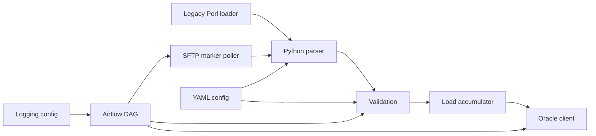

# Legacy Pipeline Migrator

Migration exercise for a legacy Perl transaction loader into a tested Python data pipeline with SFTP ingestion, Oracle-style idempotent loading, Airflow orchestration, CI, and production runbooks.

## Architecture




## Repository Layout

- `legacy/legacy_loader.pl` keeps the Perl baseline.
- `src/pipeline/` contains the Python implementation.
- `config/` externalizes mappings, thresholds, and logging — genuinely wired in, not just loaded (see `MIGRATION_NOTES.md`).
- `dags/` contains an Airflow DAG that calls the real `SftpClient` and `OracleClient` pipeline code, not stubs.
- `sql/` contains schema and reconciliation queries, including a row-level checksum query consumed by `OracleClient.reconcile_row_level`.
- `tests/` covers parser, validation, loader, SFTP client, logging setup, Oracle client (mocked), and DAG import validation.
- `tests/integration/` runs the same Oracle logic against a real database via `docker-compose.yml` — excluded from the default `pytest` run (see `integration` marker).
- `Dockerfile` + `docker-compose.yml` — a runnable app image, plus local Oracle and SFTP containers for integration testing.
- `.github/workflows/ci.yaml` runs lint + tests on every push/PR, plus a separate DAG-import-validation job.

## Quick Start

```powershell
python -m venv .venv
.\.venv\Scripts\Activate.ps1
pip install -e ".[dev]"
pytest
ruff check .
```

Run the loader against a fixture:

```powershell
python -m pipeline.loader tests\fixtures\valid_transactions.txt
```

To validate the Airflow DAG locally (optional — not part of the core dev install):

```powershell
pip install apache-airflow==2.9.3 --constraint "https://raw.githubusercontent.com/apache/airflow/constraints-2.9.3/constraints-3.10.txt"
pytest tests\test_dag.py -v
```

## Local Integration Testing (real Oracle + SFTP, not mocks)

### Oracle container fails to start: ORA-65012 (Pluggable database already exists)

Symptom: `docker compose logs oracle` shows `ORA-65012: Pluggable database FREEPDB1 already exists` during `first database startup, initializing...`, even on a freshly created volume.

Cause: `gvenzl/oracle-free` ships with a default PDB already named `FREEPDB1` baked into the image. If `docker-compose.yml`'s `oracle` service ever sets `ORACLE_DATABASE=FREEPDB1` (matching that default name), the entrypoint tries to *create* a PDB with that name and collides with the one already there.

Fix: don't set `ORACLE_DATABASE` on the `oracle` service at all — the container uses its pre-existing default PDB (still named `FREEPDB1`) without trying to recreate it. `docker-compose.yml` in this repo is already configured this way; if you see this error, check that a local edit didn't reintroduce `ORACLE_DATABASE`.

`tests/integration/` exercises `OracleClient` against a real Oracle instance —
including proving `upsert_transactions` is genuinely idempotent on rerun, and
that `reconcile_row_level` catches real data drift, not just mocked scenarios.
These are excluded from the default `pytest` run (see the `integration` marker
in `pyproject.toml`) since they need live containers.

```bash
cp .env.example .env    # adjust credentials if you want, defaults work locally
docker compose up -d oracle sftp
# wait for oracle to report healthy: docker compose ps
source .env && export ORACLE_USER ORACLE_PASSWORD ORACLE_DSN
pytest -m integration -v
docker compose down
```

Or the whole thing in one step:

```bash
./scripts/run_integration_tests.sh          # up, test, down
./scripts/run_integration_tests.sh --keep   # leave containers running afterward
```

**Note on visibility:** these are plain Docker containers (via `docker compose`), not Kubernetes pods — `docker compose ps` or a Docker-native TUI like [lazydocker](https://github.com/jesseduffield/lazydocker) will show them. K9s specifically shows Kubernetes pods and won't see these unless they're deployed to an actual cluster (Docker Desktop's built-in Kubernetes, `kind`, etc.), which this project doesn't currently use.

### Running the app as a container

```bash
docker compose build app
docker compose run --rm app tests/fixtures/valid_transactions.txt
```

## Current Implementation Stage

Weeks 1-6 of the roadmap are implemented and wired end-to-end:

- Perl baseline script (final, all review rounds closed)
- Python parser with field-count and CRLF protection
- Field validation for account id, transaction type, amount, and date — driven by `config/field_mapping.yaml`, not hardcoded
- Accumulation of totals and large debit flags, threshold driven by `config/thresholds.yaml`
- Oracle client: idempotent batched `MERGE` upserts (`executemany`), plus row-level checksum reconciliation — verified against mocks in `tests/`, and against a real Oracle instance in `tests/integration/` (see "Local Integration Testing" above)
- SFTP client with marker-file polling and proper connection cleanup (no leaked `Transport` objects)
- Airflow DAG that actually calls the SFTP and Oracle clients above, with a retry policy reasoned per task (retries for transient I/O, none for deterministic validation failures)
- Structured, YAML-driven logging (`config/logging.yaml`), with automatic log-directory creation
- Failure alerting: `_log_failure` posts to a Slack-compatible webhook (`ALERT_WEBHOOK_URL`) in addition to logging — see `src/pipeline/alerting.py` and `RUNBOOK.md`
- CI: lint + full test suite on every push/PR, with DAG import validation as a separate job

Remaining, not yet done: the `account_id`/`transaction_id` schema hasn't been validated against a real source file (see "Deliberate Schema Changes" in `MIGRATION_NOTES.md`) — that requires an actual sample from the upstream system, which isn't available yet.
