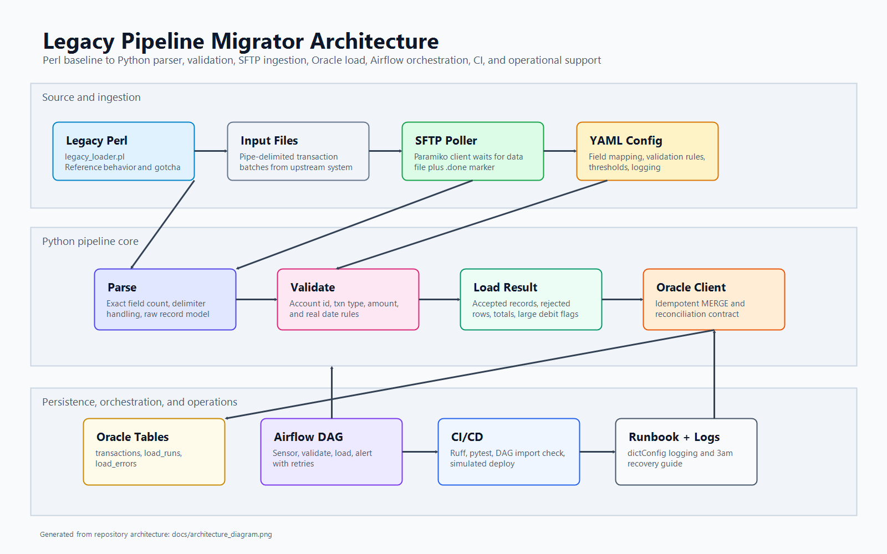
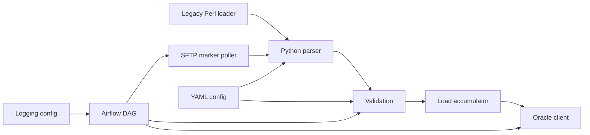

# Legacy Pipeline Migrator

Migration exercise for a legacy Perl transaction loader into a tested Python data pipeline with SFTP ingestion, Oracle-style idempotent loading, Airflow orchestration, CI, and production runbooks.

## Architecture





## Repository Layout

- `legacy/legacy_loader.pl` keeps the Perl baseline.
- `src/pipeline/` contains the Python implementation.
- `config/` externalizes mappings, thresholds, and logging — genuinely wired in, not just loaded (see `MIGRATION_NOTES.md`).
- `dags/` contains an Airflow DAG that calls the real `SftpClient` and `OracleClient` pipeline code, not stubs.
- `sql/` contains schema and reconciliation queries, including a row-level checksum query consumed by `OracleClient.reconcile_row_level`.
- `tests/` covers parser, validation, loader, SFTP client, logging setup, Oracle client, and DAG import validation.
- `.github/workflows/ci.yaml` runs lint + tests on every push/PR, plus a separate DAG-import-validation job.

## Quick Start

```powershell
python -m venv .venv
.\.venv\Scripts\Activate.ps1
pip install -e ".[dev]"
pytest
ruff check .
```

Run the loader against a fixture:

```powershell
python -m pipeline.loader tests\fixtures\valid_transactions.txt
```

To validate the Airflow DAG locally (optional — not part of the core dev install):

```powershell
pip install apache-airflow==2.9.3 --constraint "https://raw.githubusercontent.com/apache/airflow/constraints-2.9.3/constraints-3.10.txt"
pytest tests\test_dag.py -v
```

## Current Implementation Stage

Weeks 1-6 of the roadmap are implemented and wired end-to-end:

- Perl baseline script (final, all review rounds closed)
- Python parser with field-count and CRLF protection
- Field validation for account id, transaction type, amount, and date — driven by `config/field_mapping.yaml`, not hardcoded
- Accumulation of totals and large debit flags, threshold driven by `config/thresholds.yaml`
- Oracle client: idempotent batched `MERGE` upserts (`executemany`), plus row-level checksum reconciliation, both with mock-friendly tests
- SFTP client with marker-file polling and proper connection cleanup (no leaked `Transport` objects)
- Airflow DAG that actually calls the SFTP and Oracle clients above, with a retry policy reasoned per task (retries for transient I/O, none for deterministic validation failures)
- Structured, YAML-driven logging (`config/logging.yaml`), with automatic log-directory creation
- Failure alerting: `_log_failure` posts to a Slack-compatible webhook (`ALERT_WEBHOOK_URL`) in addition to logging — see `src/pipeline/alerting.py` and `RUNBOOK.md`
- CI: lint + full test suite on every push/PR, with DAG import validation as a separate job

Remaining, not yet done: the `account_id`/`transaction_id` schema hasn't been validated against a real source file (see "Deliberate Schema Changes" in `MIGRATION_NOTES.md`) — that requires an actual sample from the upstream system, which isn't available yet.
